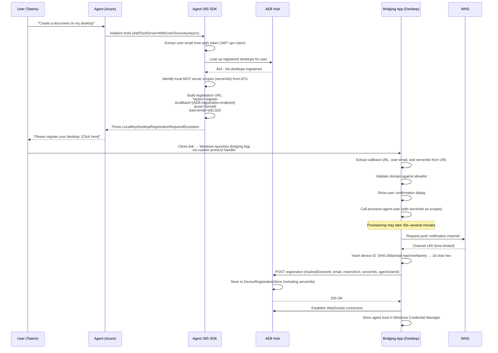
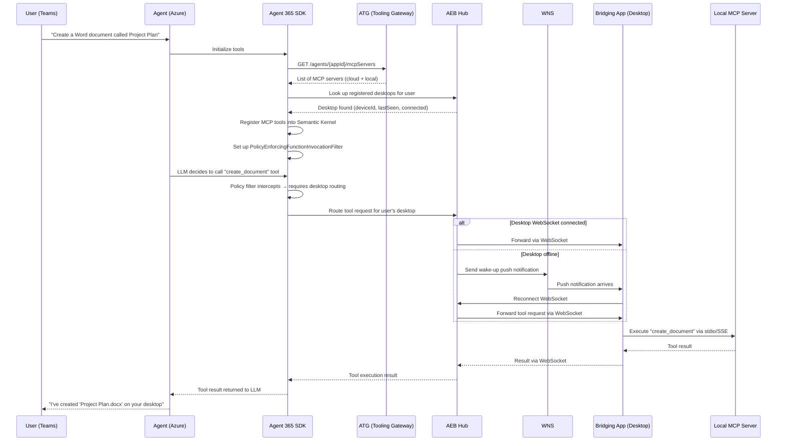

# Local Windows MCP Architecture — End-to-End Guide

> **Audience:** Engineers and PMs working on Agent 365 Local MCP  
> **Last updated:** February 25, 2026

## Overview

When an Agent 365 agent needs to access tools that run on a user's Windows desktop (e.g., local file system, desktop ODSP), the request must be routed from the cloud-hosted agent to the user's machine. This document describes every component involved and the two core flows: **Desktop Registration** and **Tool Invocation**.

---

## Architecture Diagram

Open **[local-mcp-architecture.excalidraw](local-mcp-architecture.excalidraw)** in Excalidraw for the interactive diagram.

### Component Overview

```
┌─────────────────────────────────────────────────────────────────────┐
│  USER CHANNEL                                                       │
│                    ┌─────────────────────┐                          │
│                    │  Teams / M365       │                          │
│                    │  Playground         │                          │
│                    └────────┬────────────┘                          │
└─────────────────────────────┼───────────────────────────────────────┘
                              │ Chat message
┌─────────────────────────────┼───────────────────────────────────────┐
│  AGENT LAYER (Azure)        ▼                                       │
│   ┌──────────────┐     ┌───────────────────────┐   ┌────────────┐  │
│   │ Sample Agent │────▶│    Agent 365 SDK      │──▶│    ATG     │  │
│   │ (Web App)    │     │ (SK Tool Registration │   │  (Tooling  │  │
│   └──────────────┘     │  + Policy Enforcement)│   │  Gateway)  │  │
│                         └──────────┬────────────┘   └────────────┘  │
└────────────────────────────────────┼────────────────────────────────┘
                                     │ Route tool request to desktop
┌────────────────────────────────────┼────────────────────────────────┐
│  PLATFORM SERVICES                 ▼                                │
│                                                                     │
│   ╔═══════════════════════════════════════╗          ┌────────┐    │
│   ║         AEB Hub                       ║────────▶│  WNS   │    │
│   ║   (Agent Event Bridge)                ║          │        │    │
│   ║                                       ║          └───┬────┘    │
│   ║  • Device Registration Store          ║              │         │
│   ║  • User Device Lookup                 ║              │         │
│   ║  • MCP Request Routing                ║              │         │
│   ║  • WebSocket to Desktop               ║              │         │
│   ╚═══════════════════╤═══════════════════╝              │         │
└───────────────────────┼──────────────────────────────────┼─────────┘
                        │ WebSocket (bidirectional)         │ WNS push
                        │ (bidirectional)                   │ (wake-up)
┌───────────────────────┼──────────────────────────────────┼─────────┐
│  USER'S WINDOWS       ▼ DESKTOP                          ▼         │
│   ┌──────────────────────────────────────────────────┐             │
│   │           Bridging App                            │             │
│   │   (Protocol Handler + WNS Client + MCP Bridge)   │             │
│   └─────────────────────┬────────────────────────────┘             │
│                         │ stdio / SSE                               │
│   ┌─────────────────────▼────────────────────────────┐             │
│   │           Local MCP Servers                       │             │
│   │    (File System, Settings, custom tools, etc.)    │             │
│   └──────────────────────────────────────────────────┘             │
└─────────────────────────────────────────────────────────────────────┘
```

---

## Components

### 1. Teams / M365 Playground
| | |
|---|---|
| **What it is** | The user-facing chat interface (Microsoft Teams or the M365 Agents Playground) |
| **Responsibility** | Send user messages to the agent and display responses. Render registration links when desktop registration is needed. |
| **Key data** | `Activity.From.Name` (user email in Playground, display name in Teams), `Activity.From.AadObjectId` (AAD ID) |

### 2. Sample Agent (Azure Web App)
| | |
|---|---|
| **What it is** | The AI agent deployed as an Azure Web App. Listens on `/api/messages`. |
| **Responsibility** | Receive user messages, orchestrate LLM calls, render responses. Delegates tool management to the SDK. |
| **Key code** | `Agent365Agent.cs` — calls `toolService.AddToolServersWithUserDiscoveryAsync()` during agent initialization |
| **Repo** | `Agent365-Samples1/dotnet/semantic-kernel/sample-agent` |

### 3. Agent 365 SDK
| | |
|---|---|
| **What it is** | NuGet packages that the agent references. Key packages: `Tooling.Extensions.SemanticKernel`, `Tooling.Core` |
| **Responsibility** | Tool discovery via ATG, user desktop lookup via AEB, policy enforcement, MCP tool registration into Semantic Kernel, construction of desktop registration URLs (including serverIds for local MCP server scopes) |
| **Key classes** | `McpToolRegistrationService` — orchestrates tool registration and user discovery |
| | `McpToolServerConfigurationService` — calls ATG, looks up desktops via AEB, constructs registration URLs |
| | `McpPolicyEnforcementService` — checks if a tool call needs desktop routing |
| | `PolicyEnforcingFunctionInvocationFilter` — Semantic Kernel filter that intercepts tool calls at runtime |
| **User identity** | Extracts **email/UPN** from the agentic auth token (`upn` / `preferred_username` JWT claim). Falls back to `Activity.From.Name` only if the token has no UPN claim. |
| **Repo** | `Agent365-dotnet/src/Tooling/` |

### 4. ATG (Agent Tooling Gateway)
| | |
|---|---|
| **What it is** | Cloud service at `agent365.svc.cloud.microsoft` |
| **Responsibility** | Return the list of MCP servers configured for a given agent identity. Each server has a name, URL, transport type (SSE, WNS, stdio), and scope. |
| **API** | `GET /agents/{agentInstanceId}/mcpServers` |
| **Note** | ATG returns both cloud-hosted servers AND servers that need desktop routing. The SDK determines which path to use. Each server has a unique `serverId` that identifies its scope. |

### 5. AEB Hub (Agent Event Bridge)
| | |
|---|---|
| **What it is** | A WebSocket hub service running in Azure (teams-graphservice repo). Central orchestrator for all desktop-to-cloud communication. |
| **Responsibility** | Store device registrations (hashed device ID, user email, WNS channel URI, serverIds). Look up registered desktops by user identity. Route MCP tool requests to the correct desktop via WebSocket. Wake offline desktops via WNS push notifications. Forward serverIds to Bridging App during registration. |
| **Key model** | `DeviceRegistration` — `DeviceId` (hashed), `UserId`, `TenantId`, `WnsChannelUri`, `ServerIds`, `Capabilities` |
| **Key operations** | `RegisterDevice` — accept desktop registration |
| | `LookupByUser` — find registered desktops for a user email |
| | `RouteMcpRequest` — forward tool call to desktop via WebSocket, falling back to WNS wake-up |
| **Storage** | `InMemoryDeviceRegistrationStore` (ConcurrentDictionary keyed by DeviceId) |
| **WebSocket** | Maintains persistent WebSocket connections with registered desktops for real-time bidirectional communication |
| **Repo** | `teams-graphservice` branch `users/kalavany/localmcp-hub-websocket` |

### 6. WNS (Windows Notification Service)
| | |
|---|---|
| **What it is** | Microsoft's push notification service for Windows apps |
| **Responsibility** | Deliver push notifications from AEB to a specific Windows desktop when the desktop's WebSocket connection is not active. Each desktop gets a unique channel URI during registration. |
| **Key concept** | Channel URI — a time-limited URL that AEB uses to push notifications to a specific device. Expires and must be renewed. |

### 7. Bridging App
| | |
|---|---|
| **What it is** | A Windows desktop application (MSIX-packaged, .NET). Registered as a custom protocol handler. |
| **Responsibility** | Handle custom protocol activations. Register with AEB (WNS channel + user identity + serverIds). Provision Agent User with scopes matching the serverIds. Maintain WebSocket connection to AEB. Receive tool requests and execute local MCP tool calls. Bridge between cloud requests and local MCP servers. |
| **Key files** | `ProtocolHandler.cs` — handles `?action=register&callback=...&user=...` protocol activation |
| | `WnsNotificationHandler.cs` — processes incoming WNS push notifications (wake-up) |
| | `McpClientProxy.cs` — MCP session proxy |
| | `Utilities.cs` — `GetCurrentUserEmail()`, `GetHashedDeviceId()` |
| **Privacy** | Device ID is SHA-256 hashed (`email:machineName` → 16-char hex). Raw machine name never leaves the device in network payloads. Tokens are redacted in console output. |
| **Security** | Domain allowlist validation, user confirmation dialog, trust stored in Windows Credential Manager |
| **Repo** | Bridging App repo (local) |

### 8. Local MCP Servers
| | |
|---|---|
| **What it is** | MCP-compliant tool servers running on the user's Windows machine |
| **Responsibility** | Execute tool operations that require local access (read/write files, access local ODSP sync folders, etc.) |
| **Communication** | stdio or SSE, managed by Bridging App |
| **Examples** | File system tools, ODSP local sync tools, custom enterprise tools |

---

## Flow 1: Desktop Registration

This flow occurs when the user first interacts with an agent that needs desktop tools, and no desktop is yet registered.



### Registration Payload (POST to AEB)

```json
{
  "deviceId": "a1b2c3d4e5f67890",
  "userId": "user@contoso.com",
  "agentUserId": "S-1-5-...",
  "wnsChannelUri": "https://wns2-...windows.com/...",
  "registeredAt": "2026-02-25T10:00:00Z",
  "expiresAt": "2026-03-27T10:00:00Z",
  "serverIds": ["filesystem", "odsp-local"],
  "capabilities": ["mcp-stdio", "mcp-sse"]
}
```

> **Note:** `deviceId` is a **hashed** value (SHA-256 of `email:machineName`, truncated to 16 chars). The raw machine name never leaves the device.
>
> **Note:** `serverIds` are the local MCP server scopes assigned by ATG. They flow from SDK → registration URL → Bridging App → AEB, ensuring the Agent User is provisioned with the correct scopes and AEB knows which servers this desktop supports.
>
> **Note:** `agentUserId` confirms that the Agent User was successfully provisioned. AEB can reject registrations that don't include this field.

---

## Flow 2: Tool Invocation (Desktop Registered)

This flow occurs on subsequent interactions when the user's desktop is already registered.



---

## Security Model

| Layer | Mechanism | Details |
|-------|-----------|---------|
| **URL Validation** | Domain allowlist | Bridging App validates the callback URL domain against a hardcoded allowlist before processing any registration |
| **User Consent** | Confirmation dialog | Every registration shows a dialog with agent host + machine name. Default is "No" for security. |
| **Device Identity** | SHA-256 hashing | `SHA256(email + ":" + machineName)` → truncated to 16-char lowercase hex. Raw device name never transmitted. |
| **Token Handling** | Redaction in logs | All auth tokens are redacted in console output via `RedactSecrets()` helper |
| **Agent Trust** | Windows Credential Manager | Registered agents are stored securely in Windows Credential Manager, surviving reboots |
| **User Identity** | JWT UPN claim | User email extracted from the agentic auth token's `upn` or `preferred_username` claim — not from `Activity.From.Name` (which is display name in Teams) |
| **WNS Channel** | Time-limited | Channel URIs expire and must be renewed. Expiration is tracked in the registration. |

---

## Key Identifiers

| Identifier | Source | Example | Used For |
|------------|--------|---------|----------|
| **User Email (UPN)** | Auth token `upn` claim | `user@contoso.com` | Desktop lookup via AEB, registration URL `user=` parameter |
| **Hashed Device ID** | `SHA256(email:machineName)[0..16]` | `a1b2c3d4e5f67890` | `DeviceId` in AEB registration, routing key |
| **Agent App ID** | Auth token `appid`/`azp` claim or Agentic instance ID | `xxxxxxxx-xxxx-xxxx-xxxx-xxxxxxxxxxxx` | ATG server lookup, WNS transport config |
| **WNS Channel URI** | WNS service | `https://wns2-...windows.com/...` | Push notification delivery endpoint |

---

## Error Scenarios

| Scenario | What Happens | User Experience |
|----------|-------------|-----------------|
| **No desktop registered** | SDK throws `LocalMcpDesktopRegistrationRequiredException` with registration URL | Agent shows "Please register your desktop" with clickable link |
| **Registration URL missing user** | Bridging App shows error dialog and refuses to register | "Registration failed: no user email was provided in the registration URL" |
| **Domain not in allowlist** | Bridging App blocks registration | "Registration blocked for security reasons" |
| **User denies consent** | Registration aborted | "Registration denied by user" in logs |
| **Azure OpenAI 429 (rate limit)** | LLM cannot process tool calls | Agent may fail to invoke tools; retry after backoff |
| **WNS channel expired** | Push notification fails | Desktop needs re-registration |
| **Desktop offline** | AEB sends WNS wake-up notification | Bridging App reconnects WebSocket, then receives tool request |

---

## Repository Map

| Component | Repo | Key Path |
|-----------|------|----------|
| Agent 365 SDK | `Agent365-dotnet` | `src/Tooling/` (Core, Extensions) |
| SDK Runtime Utilities | `Agent365-dotnet` | `src/Runtime/Core/Utility.cs` |
| Sample Agent | `Agent365-Samples1` | `dotnet/semantic-kernel/sample-agent/` |
| AEB Hub | `teams-graphservice` | `Source/AgentEventBridge/Hubs/Microsoft.Agent.Hub.LocalMcp/` |
| Bridging App | Bridging App repo (local) | Root directory (ProtocolHandler.cs, McpClientProxy.cs, etc.) |
| DevTools CLI | `Agent365-devTools` | `src/Microsoft.Agents.A365.DevTools.Cli/` |

---

## Configuration

### Agent (appsettings.json)
```json
{
  "LocalMcp": {
    "BaseUrl": "https://<aeb-hub-host>"
  }
}
```

### Bridging App
- **Protocol registration:** Custom URI scheme registered via MSIX package
- **Azure App ID:** Hardcoded GUID for WNS channel creation
- **Domain allowlist:** Configured in `SecurityConfig`
- **AEB connection:** WebSocket endpoint for real-time communication

### AEB Hub
- **Storage:** In-memory `ConcurrentDictionary<string, DeviceRegistration>`
- **WebSocket:** Hub for bidirectional real-time communication with desktops
- **WNS:** Push notification integration for waking offline desktops

---

## Color Legend (for Excalidraw diagram)

| Color | Layer |
|-------|-------|
| Blue (`#a5d8ff`) | User Channel (Teams / M365) |
| Green (`#b2f2bb`) | Agent Layer (Azure Web App) |
| Purple (`#d0bfff`) | Agent 365 SDK |
| Orange (`#ffd8a8`) | Platform Services (ATG, AEB) |
| Yellow (`#ffec99`) | WNS |
| Teal (`#96f2d7`) | Desktop Components (Bridging App, Local MCP Servers) |
