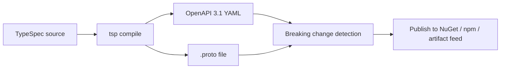

# PRD: Agent365 Sidecar — Language-Agnostic Companion Process

**Status:** Draft  
**Author:** Agent365 SDK Team  
**Date:** 2026-05-18  
**Label:** PRD

---

## 1. Problem Statement

The Agent365 .NET SDK provides four critical capabilities for AI agents operating within the Microsoft 365 ecosystem: **Observability**, **Tooling**, **Notifications**, and **Runtime** services. Today, customers must use .NET to access these capabilities.

Many customers build agents in **Python, Go, Java, JavaScript, Rust**, and other languages. They cannot integrate the SDK directly, which means they either:
- Miss out on Agent365 platform features entirely
- Build ad-hoc integrations that are fragile and unsupported
- Are forced to adopt .NET for infrastructure concerns unrelated to their agent logic

A **sidecar process** eliminates this language barrier by exposing the SDK's capabilities over standard protocols (HTTP REST + OTLP) on localhost.

---

## 2. Goals

1. **Zero-SDK integration** — Customers in any language get full Agent365 capabilities without importing a native library
2. **Standard protocols** — Use OTLP for observability and REST/gRPC for everything else (no proprietary wire formats)
3. **Code-gen friendly** — Ship OpenAPI 3.1 + .proto specs so customers auto-generate typed clients
4. **Minimal customer burden** — Configuration via env vars and a single YAML file
5. **Production-grade** — Batching, retry, health checks, graceful shutdown, and secure defaults

---

## 3. Non-Goals / Out of Scope

- **Replacing native SDKs** — The .NET SDK remains the primary integration path for .NET customers
- **Custom LLM orchestration** — The sidecar does not route prompts or manage conversations
- **Multi-tenant sidecar** — One sidecar instance per agent instance (shared-nothing)
- **UI / dashboard** — No admin portal; observability of the sidecar itself uses standard OTel
- **State management (V1)** — Customer manages their own conversation/user state; sidecar is stateless

---

## 4. Architecture Overview

```
                                M365 / Teams / Copilot
                                        │
                                Activity Protocol
                                        │
                                        ▼
┌──────────────────────────────────────────────────────────────────┐
│  Agent365 Sidecar (.NET 8)                                       │
│                                                                  │
│  ┌─ Activity Protocol Adapter ──┐  ┌─ OTLP Receiver ──────────┐ │
│  │  Receives activities from    │  │  Enrich + Filter + Export │ │
│  │  M365 channels, handles auth │  │  → Agent365 Observability │ │
│  │  Delivers to customer via    │  └──────────────────────────-┘ │
│  │  webhook (JSON or SSE)       │                                │
│  └──────────────────────────────┘  ┌─ REST API ────────────────┐ │
│                                    │  /api/v1/turns/...         │ │
│  Outbound: sends replies,          │  /api/v1/tools/...         │ │
│  typing, cards back to channel     │  /api/v1/notifications/..  │ │
│                                    │  /api/v1/runtime/...       │ │
│                                    └───────────────────────────-┘ │
└──────────────────────────────────────────────────────────────────┘
         ▲                ▲                         │
         │                │                         │
    localhost:5365    localhost:4317/4318            │
         │                │                         ▼
┌──────────────────────────────┐          Tooling Gateway + MCP Servers
│  Customer Agent              │          Agent365 Observability API
│  (Python / Go / Java / etc.) │
│                              │
│  • Exposes webhook endpoint  │
│  • Calls sidecar REST API    │
│  • Emits OTLP traces         │
└──────────────────────────────┘
```

### Key Architectural Decisions

| Decision | Choice | Rationale |
|----------|--------|-----------|
| Activity Protocol handling | Sidecar is the full adapter | Customer never deals with Bot Framework auth or protocol |
| Streaming | Opt-in via SSE; auto-detected from Content-Type | Standard protocol, works in any language |
| State management | Customer-managed (V1) | Keeps sidecar stateless; avoids storage backend dependency |
| Chunk forwarding | Immediate passthrough | No buffering/debouncing — lowest latency |
| Stream timeout | 30s silence = turn failure | Prevents hung turns from blocking channels |

---

## 5. API Surface

### 5.1 Activity Protocol Proxy (Core Messaging)

The sidecar acts as a **full Activity Protocol adapter** — it receives activities from M365 channels (Teams, Copilot, web chat), handles all Bot Framework authentication, and delivers simplified payloads to the customer's agent via a local webhook.

#### Inbound: Sidecar → Customer (webhook POST)

The sidecar POSTs to the customer's configured webhook endpoint for every incoming activity:

```jsonc
// POST http://localhost:{customerPort}/agent/turn
{
  "turnId": "550e8400-e29b-41d4-a716-446655440000",
  "type": "message",                    // message | event | conversationUpdate | invoke
  "conversationId": "conv-abc-123",
  "channelId": "msteams",
  "from": {
    "id": "user-1",
    "name": "Alice",
    "aadObjectId": "guid"
  },
  "recipient": {
    "id": "agent-1",
    "name": "My Agent"
  },
  "text": "What's the Q4 revenue?",
  "attachments": [
    { "contentType": "image/png", "contentUrl": "https://...", "name": "chart.png" }
  ],
  "timestamp": "2026-05-19T10:00:00Z",

  // Only for conversationUpdate:
  "membersAdded": [{ "id": "user-2", "name": "Bob" }],
  "membersRemoved": [],

  // Only for event:
  "eventName": "agentLifecycle",
  "eventValue": { /* structured payload */ },

  // Only for invoke:
  "invokeName": "task/fetch",
  "invokeValue": { /* structured payload */ },

  // Channel-specific data (pass-through)
  "channelData": { /* raw Teams/Copilot-specific JSON */ }
}
```

#### Customer Response Options

The customer's webhook response determines how the sidecar replies to the channel:

| Response Content-Type | Behavior |
|----------------------|----------|
| `application/json` | Single reply — sidecar sends complete response to channel |
| `text/event-stream` | **Streaming** — sidecar forwards chunks to channel in real-time |
| `204 No Content` | No reply — customer will use outbound API to respond asynchronously |

**Non-streaming response:**
```jsonc
// 200 OK, Content-Type: application/json
{
  "text": "The Q4 revenue was $4.2B, up 12% YoY.",
  "attachments": [
    { "contentType": "application/vnd.microsoft.card.adaptive", "content": { /* card JSON */ } }
  ],
  "citations": [
    { "title": "Q4 Report", "url": "https://...", "content": "..." }
  ]
}
```

**Streaming response (SSE):**
```
HTTP/1.1 200 OK
Content-Type: text/event-stream

data: {"type":"typing"}

data: {"type":"chunk","text":"The Q4"}

data: {"type":"chunk","text":" revenue was"}

data: {"type":"chunk","text":" $4.2B, up 12% YoY."}

data: {"type":"done","text":"The Q4 revenue was $4.2B, up 12% YoY.","citations":[...]}
```

#### Streaming Protocol Details

| SSE Event Type | Purpose | Required Fields |
|----------------|---------|-----------------|
| `typing` | Send typing indicator to channel | (none) |
| `chunk` | Progressive text content | `text` |
| `done` | Final complete response | `text` (full final text) |
| `error` | Signal failure mid-stream | `message`, `code` |

**Streaming rules:**
- **Opt-in**: Customer returns `Content-Type: text/event-stream` to enable streaming; `application/json` for non-streaming
- **Immediate forwarding**: Sidecar forwards each chunk to the channel immediately (no buffering)
- **Timeout**: If no SSE event received for 30 seconds, the turn is treated as a failure — sidecar sends an error to the channel and closes the connection
- **Final message**: The `done` event's `text` field is the authoritative final message (replaces any streamed chunks in channels that don't support progressive rendering)
- **Citations/cards**: Only sent with the `done` event (not with chunks)

#### Outbound: Customer → Sidecar (during or after a turn)

```yaml
# Turn-scoped responses (turn must be active)
POST /api/v1/turns/{turnId}/reply              # Send text/card/attachment reply
POST /api/v1/turns/{turnId}/typing             # Send typing indicator
POST /api/v1/turns/{turnId}/activities         # Send multiple activities
DELETE /api/v1/turns/{turnId}/activities/{id}   # Delete a previously sent message
PATCH /api/v1/turns/{turnId}/activities/{id}   # Update a previously sent message

# Proactive messaging (outside a turn)
POST /api/v1/conversations/{conversationId}/message    # Send proactive message
POST /api/v1/conversations/{conversationId}/typing     # Proactive typing indicator
```

**Reply payload:**
```jsonc
// POST /api/v1/turns/{turnId}/reply
{
  "text": "Here's what I found...",
  "textFormat": "markdown",
  "attachments": [...],
  "citations": [...],
  "suggestedActions": ["Tell me more", "Show chart"]
}
```

#### What the Sidecar Handles Internally (Hidden from Customer)

| Concern | How Sidecar Handles It |
|---------|----------------------|
| Bot Framework JWT validation | Validates channel tokens using Microsoft public keys |
| Connector client auth | Acquires outbound tokens for sending replies |
| Channel normalization | Translates Teams/Copilot/Slack differences into unified payload |
| Activity Protocol serialization | Full Activity ↔ simplified JSON translation |
| Streaming protocol translation | SSE chunks → Activity Protocol StreamingActivity |
| Proactive conversation references | Maintains conversation reference store for proactive messaging |
| Typing indicators | Translates to/from Activity typing |
| Message updates/deletes | Routes to correct channel connector |

---

### 5.1 Observability (OTLP Receiver)

The sidecar acts as an **OpenTelemetry Collector** with a custom Agent365 export pipeline.

| Endpoint | Protocol | Purpose |
|----------|----------|---------|
| `localhost:4317` | gRPC (OTLP) | Receive traces from customer agent |
| `localhost:4318/v1/traces` | HTTP (OTLP) | Receive traces (HTTP fallback) |

**Sidecar responsibilities:**
1. Receive standard OTLP spans from the customer's agent
2. Filter: only forward genAI-related spans (`invoke_agent`, `execute_tool`, `chat`, `output_messages`)
3. Enrich spans with Agent365 metadata:
   - `microsoft.session.id`
   - `gen_ai.conversation.id`
   - Tenant/agent identity from baggage or sidecar config
   - Caller details (agent name, blueprint ID, platform, version)
4. Partition spans by `(tenantId, agentId)`
5. Batch and export to Agent365 Observability API:
   - `https://agent365.svc.cloud.microsoft/observability/tenants/{tenantId}/otlp/agents/{agentId}/traces?api-version=1`
6. Handle token acquisition for export (see Auth section)

**Customer integration:**
- Point their existing OTLP exporter at `localhost:4317`
- Use semantic conventions for span names (`invoke_agent`, `execute_tool`, `chat`)
- Add span attributes matching the Agent365 schema (documented in OpenAPI spec)

**Span attribute schema (customer-facing):**

```yaml
# InvokeAgent spans
invoke_agent:
  required: [gen_ai.conversation.id]
  optional:
    - microsoft.session.id
    - microsoft.a365.caller.agent.name
    - microsoft.a365.caller.agent.id
    - microsoft.a365.caller.agent.blueprint.id
    - microsoft.a365.channel.name
    - microsoft.a365.channel.link
    - microsoft.a365.threat.diagnostics.summary

# Inference spans
chat:
  required: [gen_ai.operation.name, gen_ai.system]
  optional:
    - gen_ai.request.model
    - gen_ai.response.model
    - gen_ai.usage.input_tokens
    - gen_ai.usage.output_tokens
    - gen_ai.response.finish_reasons
    - gen_ai.conversation.id

# ExecuteTool spans
execute_tool:
  required: [gen_ai.tool.name]
  optional:
    - gen_ai.tool.call.id
    - gen_ai.tool.call.arguments
    - gen_ai.tool.description
    - microsoft.a365.tool.type
    - microsoft.a365.tool.server.name
    - microsoft.a365.threat.diagnostics.summary
```

---

### 5.2 Tooling API

| Method | Path | Description |
|--------|------|-------------|
| `GET` | `/api/v1/tools/servers` | List available MCP tool servers |
| `GET` | `/api/v1/tools/servers/{serverId}/tools` | List tools on a specific server |
| `GET` | `/api/v1/tools` | List all tools across all servers (flattened) |
| `POST` | `/api/v1/tools/servers/{serverId}/tools/{toolName}/invoke` | Invoke a specific tool |
| `POST` | `/api/v1/tools/chat-history` | Send conversation context to MCP server |

**Models:**

```typescript
interface McpToolServer {
  id: string;
  name: string;
  url: string;
  scope?: string;
  audience?: string;
  publisher?: string;
}

interface McpTool {
  name: string;
  description?: string;
  inputSchema: object;  // JSON Schema
  serverName: string;
  serverId: string;
}

interface ToolInvocationRequest {
  arguments: object;
  conversationContext?: {
    conversationId?: string;
    channelId?: string;
    subChannelId?: string;
    userMessage?: string;
  };
}

interface ToolInvocationResponse {
  result: object;
  isError: boolean;
  errorMessage?: string;
}
```

**Auth flow:**
- Customer provides a bearer token (from their auth flow) in `Authorization` header to the sidecar
- Sidecar uses this token to call the Tooling Gateway
- For V2 MCP servers, sidecar exchanges tokens for audience-scoped tokens
- Sidecar adds required context headers (`x-ms-conversation-id`, `x-ms-channel-id`, etc.) to MCP server calls

---

### 5.3 Notifications API

| Method | Path | Description |
|--------|------|-------------|
| `POST` | `/api/v1/notifications/subscribe` | Register a webhook URL for notification types |
| `GET` | `/api/v1/notifications/subscriptions` | List active subscriptions |
| `DELETE` | `/api/v1/notifications/subscriptions/{id}` | Remove a subscription |
| `GET` | `/api/v1/notifications/schemas` | Get notification payload schemas |
| `POST` | `/api/v1/notifications/{id}/ack` | Acknowledge a notification |

**Supported notification subchannels:**
- `email` — Email notifications (EmailReference model)
- `word` — Word document comments (WpxComment model)
- `excel` — Excel interactions (WpxComment model)
- `powerpoint` — PowerPoint interactions (WpxComment model)
- `FederatedKnowledgeService` — Knowledge service events

**Lifecycle events:**
- `agenticUserIdentityCreated`
- `agenticUserWorkloadOnboardingUpdated`
- `agenticUserDeleted`
- `agenticUserUndeleted`
- `agenticUserIdentityUpdated`
- `agenticUserManagerUpdated`
- `agenticUserEnabled`
- `agenticUserDisabled`

**Subscription model:**

```typescript
interface NotificationSubscription {
  id: string;
  subChannels: string[];         // e.g., ["email", "word"]
  lifecycleEvents?: string[];    // e.g., ["agenticUserIdentityCreated"]
  webhookUrl: string;            // localhost URL to POST notifications to
  secret?: string;               // HMAC signing secret for webhook validation
}

interface NotificationWebhookPayload {
  id: string;
  timestamp: string;
  type: "subchannel" | "lifecycle";
  subChannel?: string;
  lifecycleEvent?: string;
  data: EmailNotification | WpxCommentNotification | LifecycleNotification;
}

interface EmailNotification {
  id: string;
  conversationId: string;
  htmlBody: string;
}

interface WpxCommentNotification {
  odataId: string;
  documentId: string;
  parentCommentId?: string;
  commentId: string;
}
```

**Flow:**
1. Customer registers a webhook URL with the sidecar
2. Sidecar receives M365 notification activities via the Agent Framework channel
3. Sidecar parses the activity, wraps it in the webhook payload schema
4. Sidecar POSTs to the customer's registered webhook URL
5. Customer processes and optionally ACKs

---

### 5.4 Runtime API

| Method | Path | Description |
|--------|------|-------------|
| `GET` | `/api/v1/runtime/context` | Get current tenant/agent context |
| `POST` | `/api/v1/runtime/auth/exchange` | Exchange a token for a scoped token |
| `GET` | `/api/v1/runtime/identity` | Get resolved agent identity |

**Models:**

```typescript
interface TenantContext {
  tenantId?: string;
  workerId?: string;
  agentId?: string;
  source: "claims" | "headers" | "config";
}

interface TokenExchangeRequest {
  token: string;
  scopes: string[];
  authHandlerName?: string;
}

interface TokenExchangeResponse {
  accessToken: string;
  expiresAt: string;
}
```

---

### 5.5 Health & Lifecycle

| Method | Path | Description |
|--------|------|-------------|
| `GET` | `/healthz` | Liveness probe |
| `GET` | `/readyz` | Readiness probe (Gateway reachable, token valid) |
| `GET` | `/api/v1/status` | Detailed status (connections, queue depth, export stats) |
| `POST` | `/api/v1/shutdown` | Graceful shutdown (flush queues, close connections) |

---

## 6. Configuration

### 6.1 Configuration File (`a365-sidecar.yaml`)

```yaml
agent:
  id: "my-agent-id"
  blueprintId: "blueprint-guid"
  name: "My Agent"

tenant:
  id: "tenant-guid"
  # Or extract from incoming requests:
  extractFrom: "header"  # "header" | "config" | "token"

auth:
  mode: "client-credentials"  # "managed-identity" | "client-credentials" | "fmi"
  clientId: "${AZURE_CLIENT_ID}"
  clientSecret: "${AZURE_CLIENT_SECRET}"
  tenantId: "${AZURE_TENANT_ID}"

# Activity Protocol / messaging
messaging:
  enabled: true
  customerWebhook: "http://localhost:8080/agent/turn"  # Where to deliver activities
  streaming:
    enabled: true              # Allow SSE streaming responses
    timeoutSeconds: 30         # Silence timeout — turn fails if exceeded
  proactive:
    enabled: true              # Allow proactive messaging

observability:
  enabled: true
  otlpGrpcPort: 4317
  otlpHttpPort: 4318
  exporterDomain: "agent365.svc.cloud.microsoft"  # override for non-prod
  batchSettings:
    maxQueueSize: 2048
    scheduledDelayMs: 5000
    maxExportBatchSize: 512
    maxPayloadBytes: 4194304  # 4MB

tooling:
  enabled: true
  gatewayEndpoint: "${A365_TOOLING_GATEWAY_ENDPOINT}"

notifications:
  enabled: true

server:
  port: 5365
  bindAddress: "127.0.0.1"  # localhost only by default
```

### 6.2 Environment Variables

| Variable | Purpose | Default |
|----------|---------|---------|
| `A365_SIDECAR_CONFIG` | Path to config file | `./a365-sidecar.yaml` |
| `A365_AGENT_ID` | Agent instance ID | (from config) |
| `A365_TENANT_ID` | Tenant ID | (from config) |
| `A365_BLUEPRINT_ID` | Blueprint ID | (from config) |
| `A365_AUTH_MODE` | Auth mode | `client-credentials` |
| `AZURE_CLIENT_ID` | Entra app client ID | — |
| `AZURE_CLIENT_SECRET` | Entra app client secret | — |
| `AZURE_TENANT_ID` | Entra tenant ID | — |
| `A365_SIDECAR_PORT` | REST API port | `5365` |
| `A365_OTLP_GRPC_PORT` | OTLP gRPC port | `4317` |
| `A365_OTLP_HTTP_PORT` | OTLP HTTP port | `4318` |
| `A365_CUSTOMER_WEBHOOK` | Customer's webhook URL for activity delivery | `http://localhost:8080/agent/turn` |
| `A365_STREAMING_TIMEOUT` | SSE silence timeout (seconds) | `30` |
| `A365_OBSERVABILITY_DOMAIN_OVERRIDE` | Override exporter domain | — |
| `A365_OBSERVABILITY_SCOPE_OVERRIDE` | Override auth scope | — |
| `A365_TOOLING_GATEWAY_ENDPOINT` | Tooling Gateway URL | — |
| `A365_BIND_ADDRESS` | Bind address | `127.0.0.1` |

---

## 7. Authentication

### 7.1 Auth Modes

| Mode | Use Case | Token Acquisition |
|------|----------|-------------------|
| **Managed Identity** | Azure-hosted agents | DefaultAzureCredential → scope-specific tokens |
| **Client Credentials** | Any environment with Entra app registration | Client credential flow → scope-specific tokens |
| **FMI (3-hop)** | Power Platform / M365 delegated scenarios | FMI token chain with OBO exchange |

### 7.2 Token Usage

| Target | Scope | Source |
|--------|-------|--------|
| Agent365 Observability API | `api://9b975845-388f-4429-889e-eab1ef63949c/Agent365.Observability.OtelWrite` | Sidecar acquires autonomously |
| Tooling Gateway | MCP Platform scope (from config) | Customer passes token or sidecar acquires |
| MCP Servers (V1) | Shared ATG token (`ea9ffc3e-...`) | Sidecar exchanges |
| MCP Servers (V2) | Per-server audience scope | Sidecar exchanges per audience |

### 7.3 Customer-Provided Tokens

For Tooling APIs, the customer passes their user/agent token in the `Authorization` header of their request to the sidecar. The sidecar uses this token to:
1. Authenticate with the Tooling Gateway
2. Exchange for MCP-server-specific tokens as needed

This preserves the delegated identity model without the sidecar needing direct access to user credentials.

---

## 8. Security

| Concern | Mitigation |
|---------|------------|
| **Network exposure** | Bind to `127.0.0.1` by default; explicit opt-in for non-localhost |
| **Token handling** | Tokens cached in-memory only, never persisted to disk |
| **Customer tokens** | Pass-through only; sidecar does not log or store token values |
| **Webhook validation** | HMAC-SHA256 signing of notification payloads with customer-provided secret |
| **TLS** | Optional mTLS for non-localhost deployments |
| **Config secrets** | Support env var substitution in YAML (`${VAR}` syntax) |

---

## 9. Deployment Models

### 9.1 Docker Container (Primary)

```dockerfile
FROM mcr.microsoft.com/dotnet/aspnet:8.0 AS runtime
COPY publish/ /app/
WORKDIR /app
EXPOSE 4317 4318 5365
ENTRYPOINT ["./Agent365.Sidecar"]
```

```yaml
# docker-compose.yml
services:
  my-agent:
    build: ./my-agent
    environment:
      - OTEL_EXPORTER_OTLP_ENDPOINT=http://a365-sidecar:4318
      - A365_SIDECAR_URL=http://a365-sidecar:5365
    depends_on:
      - a365-sidecar

  a365-sidecar:
    image: mcr.microsoft.com/agent365/sidecar:latest
    environment:
      - A365_AGENT_ID=my-agent
      - A365_AUTH_MODE=client-credentials
      - AZURE_CLIENT_ID=${AZURE_CLIENT_ID}
      - AZURE_CLIENT_SECRET=${AZURE_CLIENT_SECRET}
      - AZURE_TENANT_ID=${AZURE_TENANT_ID}
    ports:
      - "127.0.0.1:4317:4317"
      - "127.0.0.1:4318:4318"
      - "127.0.0.1:5365:5365"
```

### 9.2 Kubernetes Sidecar

```yaml
spec:
  containers:
    - name: my-agent
      image: my-agent:latest
      env:
        - name: OTEL_EXPORTER_OTLP_ENDPOINT
          value: "http://localhost:4318"
        - name: A365_SIDECAR_URL
          value: "http://localhost:5365"
    - name: a365-sidecar
      image: mcr.microsoft.com/agent365/sidecar:latest
      ports:
        - containerPort: 4317
        - containerPort: 4318
        - containerPort: 5365
      envFrom:
        - secretRef:
            name: a365-sidecar-secrets
      livenessProbe:
        httpGet:
          path: /healthz
          port: 5365
      readinessProbe:
        httpGet:
          path: /readyz
          port: 5365
```

### 9.3 Standalone Binary

For local development or non-containerized deployments. Published as a self-contained, trimmed .NET 8 executable — **no .NET runtime required**.

```bash
# Download (platform-specific)
curl -L https://aka.ms/a365-sidecar/linux-x64 -o a365-sidecar && chmod +x a365-sidecar
curl -L https://aka.ms/a365-sidecar/win-x64 -o a365-sidecar.exe
curl -L https://aka.ms/a365-sidecar/osx-arm64 -o a365-sidecar && chmod +x a365-sidecar

# Run
A365_AGENT_ID=my-agent A365_AUTH_MODE=managed-identity ./a365-sidecar
```

### 9.4 OS Packages

| Platform | Format | Install |
|----------|--------|---------|
| Debian/Ubuntu | `.deb` | `apt install a365-sidecar` |
| RHEL/Fedora | `.rpm` | `dnf install a365-sidecar` |
| Windows | `winget` | `winget install Microsoft.Agent365.Sidecar` |
| macOS | `brew` | `brew install a365-sidecar` |

Installs as a systemd service (Linux) or Windows Service, auto-starting with the system.

---

## 10. TypeSpec Contract Workflow

### 10.1 Authoring

```
src/Sidecar/
├── typespec/
│   ├── main.tsp              # Service definition
│   ├── models/
│   │   ├── tooling.tsp       # Tooling models
│   │   ├── notifications.tsp # Notification models
│   │   ├── runtime.tsp       # Runtime models
│   │   └── observability.tsp # Span attribute schemas
│   ├── tspconfig.yaml        # Emitter configuration
│   └── package.json
├── generated/
│   ├── openapi/
│   │   └── a365-sidecar-v1.yaml
│   └── proto/
│       └── a365_sidecar_v1.proto
```

### 10.2 CI Pipeline



- **Breaking change gate**: CI compares generated spec against previous release; blocks merge if breaking
- **Generated clients**: Optionally publish pre-built clients for Python, Go, JS to package registries

### 10.3 Customer Workflow

```bash
# Python customer
openapi-generator generate -i a365-sidecar-v1.yaml -g python -o ./a365_client

# Go customer  
oapi-codegen -package a365 a365-sidecar-v1.yaml > a365_client.go

# Java customer
openapi-generator generate -i a365-sidecar-v1.yaml -g java -o ./a365-client

# gRPC customer (any language)
protoc --go_out=. --go-grpc_out=. a365_sidecar_v1.proto
```

---

## 11. Versioning & Backward Compatibility

| Aspect | Strategy |
|--------|----------|
| **API versioning** | URL path: `/api/v1/`, `/api/v2/` |
| **OTLP versioning** | Standard OTLP protocol versioning (stable) |
| **Breaking changes** | New major version path; old version supported for 12 months |
| **Additive changes** | New endpoints/fields added without version bump |
| **Deprecation** | `Sunset` header + 6-month notice in changelog |
| **TypeSpec gate** | CI blocks breaking changes unless version is bumped |

---

## 12. Performance Considerations

| Concern | Approach |
|---------|----------|
| **OTLP ingestion** | Async queue; back-pressure via bounded channel (MaxQueueSize) |
| **Span export batching** | Configurable batch size/delay; chunked by MaxPayloadBytes (4MB default) |
| **Tooling Gateway** | Connection pooling via HttpClientFactory; configurable timeout |
| **MCP connections** | Persistent connections per server; lazy initialization |
| **Memory** | Bounded queues prevent OOM; token cache with TTL-based eviction |
| **Startup time** | < 2s cold start target; lazy initialization for unused modules |

---

## 13. Observability of the Sidecar Itself

The sidecar emits its own telemetry (separate from customer spans):

- **Metrics**: `a365_sidecar_spans_received`, `a365_sidecar_spans_exported`, `a365_sidecar_export_errors`, `a365_sidecar_tools_invoked`, `a365_sidecar_notifications_relayed`
- **Traces**: Internal spans for gateway calls, token exchanges, export batches
- **Logs**: Structured logging (JSON) to stdout
- **Export**: Standard OTLP to a configurable external collector (not to itself)

---

## 14. Error Handling

| Scenario | Behavior |
|----------|----------|
| **Token acquisition failure** | Return 503 on Tooling/Runtime APIs; queue spans for retry on Observability |
| **Tooling Gateway unreachable** | Return 502 with retry-after header |
| **MCP server timeout** | Return 504 with server name in error |
| **OTLP export failure** | Retry with exponential backoff; drop after queue full |
| **Invalid spans** | Accept but filter silently (don't break customer's telemetry pipeline) |
| **Webhook delivery failure** | Retry 3x with backoff; dead-letter after exhaustion |

---

## 15. Success Metrics

| Metric | Target |
|--------|--------|
| **Adoption** | 50+ non-.NET agents using sidecar within 6 months of GA |
| **Latency overhead** | < 5ms p99 added latency for tool invocations |
| **Span delivery** | > 99.5% of genAI spans successfully exported |
| **MTTR** | Customer can go from zero to integrated in < 30 minutes |
| **Language coverage** | Verified code-gen clients for Python, Go, Java, JavaScript, Rust |

---

## 16. Implementation Phases

### Phase 1: Foundation (Weeks 1–3)
- Project scaffolding (.NET 8 ASP.NET Core minimal API)
- TypeSpec project setup + CI
- Configuration model (YAML + env vars)
- Health endpoints
- Docker image build pipeline
- Standalone binary publish (self-contained, trimmed)

### Phase 2: Activity Protocol Proxy (Weeks 3–7)
- Bot Framework CloudAdapter integration
- JWT validation for incoming channel activities
- Activity → simplified JSON translation
- Webhook delivery to customer endpoint
- Non-streaming response path (JSON → reply Activity)
- SSE streaming response path (chunked → StreamingActivity)
- 30s silence timeout handling
- Outbound turn API (reply, typing, delete, update)
- Proactive messaging API + conversation reference store
- Connector client auth for outbound messages

### Phase 3: Observability (Weeks 7–10)
- OTLP gRPC + HTTP receivers
- Span filtering (genAI-only)
- Span enrichment from config
- Agent365 Exporter integration (reuse existing `Agent365ExporterCore`)
- Token acquisition (client-credentials mode)
- Batch queue management

### Phase 4: Tooling (Weeks 10–13)
- Tooling Gateway client (reuse `McpToolServerConfigurationService`)
- Server discovery endpoint
- Tool enumeration endpoint
- Tool invocation proxy (MCP client call-through)
- Token exchange for V1/V2 servers
- Context header propagation

### Phase 5: Notifications + Runtime (Weeks 13–15)
- Notification webhook subscription management
- Activity → webhook payload transformation for notification subchannels
- HMAC signing for webhook delivery
- Managed Identity auth mode
- FMI 3-hop auth mode
- Token exchange endpoint

### Phase 6: Polish & GA (Weeks 15–17)
- TypeSpec spec finalization + generated client verification
- Performance benchmarking
- Security review
- Documentation + quickstart guides per language
- Published Docker image to MCR
- Standalone binaries published (linux-x64, win-x64, osx-arm64)

---

## 17. Dependencies

| Dependency | Version | Purpose |
|------------|---------|---------|
| .NET 8 | 8.0 | Runtime |
| ASP.NET Core Minimal API | 8.0 | HTTP server |
| Microsoft.Agents.Builder | current | Activity Protocol adapter, CloudAdapter, turn context |
| Microsoft.Agents.Hosting.AspNetCore | current | ASP.NET Core hosting for Bot Framework |
| OpenTelemetry.Proto | 1.x | OTLP protobuf deserialization |
| Grpc.AspNetCore | 2.x | gRPC OTLP receiver |
| Microsoft.Agents.A365.Observability.Runtime | current | Reuse ExportFormatter, Agent365ExporterCore |
| Microsoft.Agents.A365.Tooling.Core | current | Reuse McpToolServerConfigurationService |
| Microsoft.Agents.A365.Notifications | current | Reuse notification models + routing |
| Microsoft.Agents.A365.Runtime | current | Reuse TenantContextHelper, auth |
| Azure.Identity | 1.x | Token acquisition |
| TypeSpec CLI | latest | Contract generation |

---

## 18. Risks & Mitigations

| Risk | Likelihood | Impact | Mitigation |
|------|-----------|--------|------------|
| **Activity Protocol surface is large** | High | High | Only translate the 80% case (message, conversationUpdate, event); pass raw JSON for invoke/custom types |
| OTLP span schema drift between sidecar and SDK | Medium | High | Shared constants package; snapshot tests |
| Token exchange complexity for V2 MCP servers | Medium | Medium | Start with V1 support; V2 in Phase 5 |
| Performance overhead for high-throughput agents | Low | High | Benchmark early; bounded queues; async I/O |
| Breaking TypeSpec/OpenAPI changes | Medium | Medium | CI gate; semver enforcement |
| Customer confusion: sidecar vs SDK | Low | Medium | Clear docs; decision tree in quickstart |
| Streaming edge cases (partial chunks, disconnects) | Medium | Medium | Well-defined SSE protocol; timeout kills turn; final `done` event is authoritative |

---

## 19. Open Questions

1. ~~**Should the sidecar support being a full Bot Framework adapter?**~~ → **YES** — decided. Sidecar handles full Activity Protocol.
2. **Should we publish pre-built thin clients** (Python, Go, JS packages) or let customers code-gen their own?
3. **Should the sidecar support multi-agent** (multiple agent IDs routing through one sidecar) or strictly 1:1?
4. **What is the minimum telemetry contract** customers must emit for spans to be meaningful? (Just operation name, or full attribute set?)
5. **Should we support a "local dev" mode** that mocks the Tooling Gateway and Observability API for offline development?
6. **How should invoke activities be handled?** (e.g., Teams task/fetch — should sidecar translate to a simpler callback or pass through raw?)
7. **Should the sidecar support Adaptive Card action routing** or should those be opaque to the customer?

### Resolved Questions

| Question | Decision | Rationale |
|----------|----------|-----------|
| Streaming opt-in mechanism | Auto-detect from response `Content-Type` | Simple; no config per-turn |
| Chunk forwarding strategy | Immediate passthrough (no buffering) | Lowest latency |
| State management (V1) | Customer-managed; sidecar is stateless | Simplifies sidecar; no storage backend |
| Stream silence timeout | 30s = turn failure | Prevents hung turns |
| Shipping formats | Docker + standalone binary + OS packages | Covers container and non-container infra |
| Sidecar ↔ Customer auth | None on localhost (default) | Same as Dapr/OTel Collector/Envoy model |

---

## 20. Appendix A: Comparison with Alternatives

| Approach | Pros | Cons | Verdict |
|----------|------|------|---------|
| **Per-language SDKs** | Deep integration, no network hop | Massive maintenance burden (5+ languages) | ❌ Not scalable |
| **Sidecar (this PRD)** | One implementation, any language | Extra process, latency for tool calls | ✅ Best balance |
| **Dapr component** | Ecosystem alignment, K8s-native | Heavy dependency, limited to Dapr users | ❌ Too narrow |
| **Service mesh plugin** | Zero app changes for observability | Can't expose Tooling/Notifications | ❌ Incomplete |
| **WASM plugin** | In-process, no network hop | Immature ecosystem, limited .NET interop | ❌ Too early |

---

## 21. Appendix B: Customer Journey (Python Example)

```python
# ============================================================
# Customer's agent — a simple Python HTTP server
# This is ALL the customer writes. No SDK, no Bot Framework.
# ============================================================

from flask import Flask, request, Response
import requests
import json

app = Flask(__name__)
SIDECAR = "http://localhost:5365"

# 1. Receive activities from the sidecar
@app.route("/agent/turn", methods=["POST"])
def handle_turn():
    turn = request.json
    turn_id = turn["turnId"]
    user_text = turn.get("text", "")

    if turn["type"] == "conversationUpdate":
        # Greet new members
        for member in turn.get("membersAdded", []):
            requests.post(f"{SIDECAR}/api/v1/turns/{turn_id}/reply", json={
                "text": f"Welcome, {member['name']}!"
            })
        return "", 204

    if turn["type"] == "message":
        # Option A: Non-streaming response (simple JSON reply)
        if user_text == "hello":
            return {"text": "Hi there! How can I help?"}, 200

        # Option B: Streaming response (SSE)
        def generate():
            yield 'data: {"type":"typing"}\n\n'
            
            # Stream from your LLM
            for chunk in call_my_llm(user_text):
                yield f'data: {json.dumps({"type":"chunk","text":chunk})}\n\n'
            
            yield f'data: {json.dumps({"type":"done","text":full_response})}\n\n'

        return Response(generate(), content_type="text/event-stream")

    return "", 204


# 2. Use Tooling API (discover and invoke MCP tools)
def call_with_tools(user_text, token):
    # Discover available tools
    tools = requests.get(f"{SIDECAR}/api/v1/tools", 
                        headers={"Authorization": f"Bearer {token}"}).json()
    
    # Invoke a tool
    result = requests.post(
        f"{SIDECAR}/api/v1/tools/servers/search-server/tools/search/invoke",
        headers={"Authorization": f"Bearer {token}"},
        json={"arguments": {"query": user_text}}
    ).json()
    
    return result


# 3. Configure OTLP export to sidecar (standard OpenTelemetry)
from opentelemetry.sdk.trace.export import BatchSpanProcessor
from opentelemetry.exporter.otlp.proto.grpc.trace_exporter import OTLPSpanExporter

exporter = OTLPSpanExporter(endpoint="http://localhost:4317", insecure=True)
# provider.add_span_processor(BatchSpanProcessor(exporter))

# 4. Create genAI spans with correct attributes
from opentelemetry import trace
tracer = trace.get_tracer("my-agent")

def call_my_llm(user_text):
    with tracer.start_as_current_span("invoke_agent") as span:
        span.set_attribute("gen_ai.conversation.id", "conv-123")
        
        with tracer.start_as_current_span("chat") as inference_span:
            inference_span.set_attribute("gen_ai.operation.name", "chat")
            inference_span.set_attribute("gen_ai.system", "openai")
            inference_span.set_attribute("gen_ai.request.model", "gpt-4")
            # ... yield chunks from LLM ...
            inference_span.set_attribute("gen_ai.usage.input_tokens", 150)
            inference_span.set_attribute("gen_ai.usage.output_tokens", 50)


if __name__ == "__main__":
    app.run(port=8080)
```

**What the customer gets with this ~50 lines of code:**
- ✅ Full M365 agent (works in Teams, Copilot, web chat)
- ✅ Streaming responses
- ✅ MCP tool discovery and invocation
- ✅ Distributed tracing exported to Agent365 Observability
- ✅ No Bot Framework SDK, no .NET, no Activity Protocol knowledge

---

*End of PRD*
